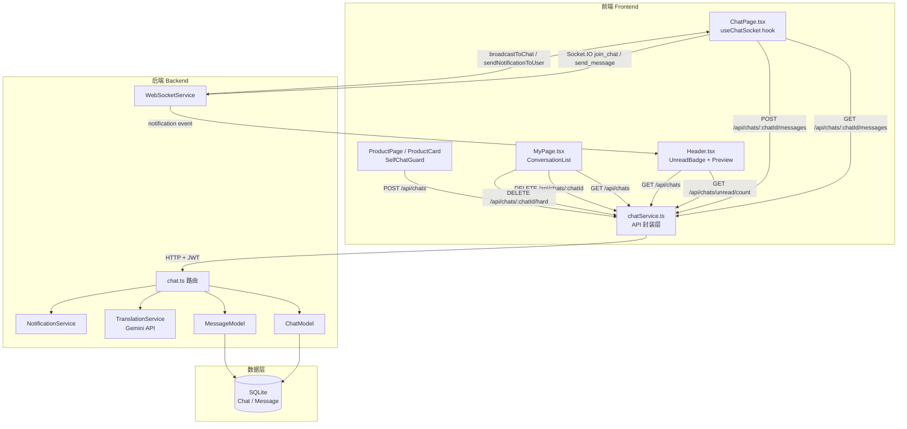
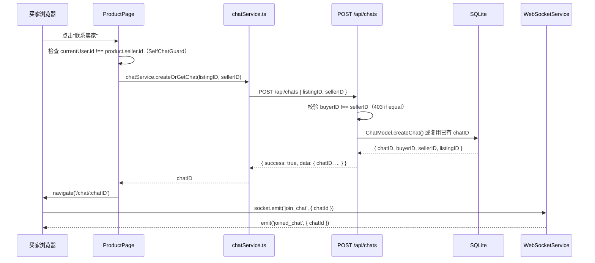
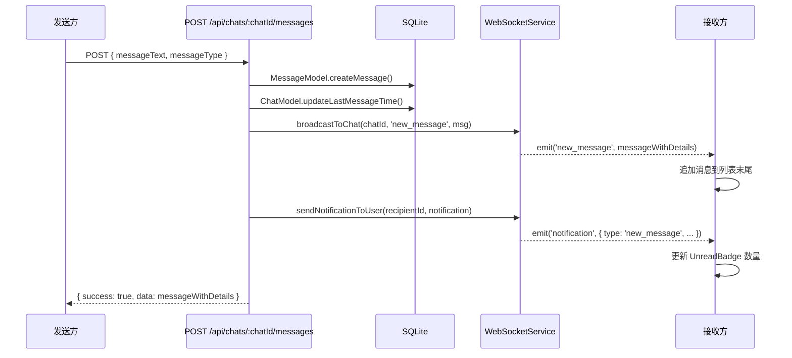
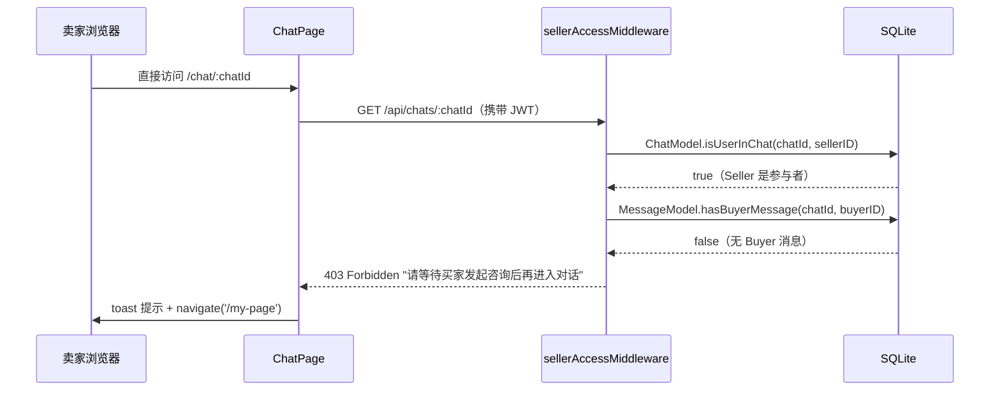

# 技术设计文档：聊天功能增强（Chat Enhancement）

## 概述

本文档描述 Uniy Market 聊天功能增强的完整技术设计。核心目标是将现有静态 mock 前端接入真实后端 API 与 WebSocket 实时通信，同时补全缺失的后端端点、替换翻译服务、并实现完整的对话管理流程。

设计原则：**最小化改动范围，最大化复用现有代码**。后端 `chat.ts` 路由、`ChatModel`、`MessageModel`、`WebSocketService` 均已完整实现，前端主要工作是接入真实数据并重构 `ChatPage.tsx`。

---

## 架构

### 系统组件图



### 关键数据流序列图

#### 1. 买家发起聊天完整流程



#### 2. 实时消息收发流程



#### 3. 卖家 URL 直访校验流程



---

## 组件与接口设计

### 前端新增文件

#### `chatService.ts`（前端 API 封装层）

路径：`Product Retrieval Main Page/src/services/chatService.ts`

封装所有聊天相关 API 调用，统一错误处理，避免各组件直接调用 `apiClient`。

```typescript
// 核心接口定义 / Core interface definitions
export interface ChatSummary {
  chatID: string;
  buyerID: string;
  sellerID: string;
  listingID: string;
  productTitle: string;
  productImage: string;
  buyerName: string;
  sellerName: string;
  buyerImage: string;
  sellerImage: string;
  unreadCount: number;
  lastMessageAt: string;
  status: 'active' | 'closed' | 'deleted';
  // 最新消息预览文本（通过后端子查询补充）/ Latest message preview text (added via backend subquery)
  lastMessageText?: string;
}

export interface MessageDetail {
  messageID: string;
  chatID: string;
  senderID: string;
  senderName: string;
  senderImage: string;
  messageText: string;
  messageType: 'text' | 'image';
  isTranslated: boolean;
  translatedText?: string;
  timestamp: string;
  isRead: boolean;
}

export const chatService = {
  // 创建或获取聊天 / Create or get chat
  createOrGetChat: (listingID: string, sellerID: string) =>
    apiClient.post<ApiResponse<ChatSummary>>('/chats', { listingID, sellerID }),

  // 获取聊天详情 / Get chat details
  getChatById: (chatId: string) =>
    apiClient.get<ApiResponse<ChatSummary>>(`/chats/${chatId}`),

  // 获取用户所有聊天 / Get all chats for user
  getChats: (page = 1, limit = 20) =>
    apiClient.get<ApiResponse<{ data: ChatSummary[] }>>(`/chats?page=${page}&limit=${limit}`),

  // 获取消息列表 / Get messages
  getMessages: (chatId: string, page = 1, limit = 50) =>
    apiClient.get<ApiResponse<{ data: MessageDetail[] }>>(`/chats/${chatId}/messages?page=${page}&limit=${limit}`),

  // 发送文本消息 / Send text message
  sendTextMessage: (chatId: string, messageText: string) =>
    apiClient.post<ApiResponse<MessageDetail>>(`/chats/${chatId}/messages`, { messageText, messageType: 'text' }),

  // 发送图片消息 / Send image message
  sendImageMessage: (chatId: string, file: File) => {
    const form = new FormData();
    form.append('image', file);
    form.append('messageType', 'image');
    return apiClient.post<ApiResponse<MessageDetail>>(`/chats/${chatId}/messages`, form, {
      headers: { 'Content-Type': 'multipart/form-data' },
    });
  },

  // 标记已读 / Mark as read
  markAsRead: (chatId: string) =>
    apiClient.put(`/chats/${chatId}/read`),

  // 获取未读数 / Get unread count
  getUnreadCount: () =>
    apiClient.get<ApiResponse<{ unreadCount: number }>>('/chats/unread/count'),

  // 软删除（隐藏）/ Soft delete (hide)
  hideChat: (chatId: string) =>
    apiClient.delete(`/chats/${chatId}`),

  // 硬删除（永久）/ Hard delete (permanent)
  hardDeleteChat: (chatId: string) =>
    apiClient.delete(`/chats/${chatId}/hard`),

  // 翻译消息 / Translate message
  translateMessage: (chatId: string, messageId: string, targetLanguage: string) =>
    apiClient.post<ApiResponse<{ translatedText: string }>>(`/chats/${chatId}/messages/${messageId}/translate`, { targetLanguage }),
};
```

#### `useChatSocket.ts`（WebSocket Hook）

路径：`Product Retrieval Main Page/src/hooks/useChatSocket.ts`

封装 Socket.IO 连接生命周期，供 `ChatPage` 使用。**【Bug Fix】使用 `useRef` 持有最新回调，避免闭包捕获初始空数组。**

```typescript
// useChatSocket.ts 核心设计 / Core design
// 【Bug Fix】使用 useRef 持有最新 onNewMessage 回调，避免闭包陷阱
// 【Bug Fix】Use useRef to hold latest onNewMessage callback, avoiding stale closure trap
import { useEffect, useRef, useCallback } from 'react';
import { io, Socket } from 'socket.io-client';

const SOCKET_URL = import.meta.env.VITE_SOCKET_URL || 'http://localhost:3000';

export function useChatSocket(chatId: string, onNewMessage: (msg: MessageDetail) => void) {
  const socketRef = useRef<Socket | null>(null);
  // 通过 ref 持有最新回调，确保 socket 事件处理器始终调用最新版本
  // Hold latest callback via ref so socket event handler always calls the latest version
  const onNewMessageRef = useRef(onNewMessage);
  useEffect(() => { onNewMessageRef.current = onNewMessage; }, [onNewMessage]);

  useEffect(() => {
    const token = sessionStorage.getItem('authToken');
    if (!token || !chatId) return;

    // 建立连接，携带 JWT / Connect with JWT
    const socket = io(SOCKET_URL, {
      auth: { token },
      transports: ['websocket', 'polling'],
    });

    socketRef.current = socket;

    socket.on('connect', () => {
      socket.emit('join_chat', { chatId });
    });

    // 通过 ref 调用，永远不会捕获旧的 messages 状态
    // Call via ref, never captures stale messages state
    socket.on('new_message', (msg) => onNewMessageRef.current(msg));

    socket.on('connect_error', (err) => {
      console.error('Socket connection error:', err.message);
    });

    // 组件卸载时清理 / Cleanup on unmount
    return () => {
      socket.emit('leave_chat', { chatId });
      socket.disconnect();
    };
  }, [chatId]);

  const emitTyping = useCallback((isTyping: boolean) => {
    socketRef.current?.emit(isTyping ? 'typing_start' : 'typing_stop', { chatId });
  }, [chatId]);

  return { emitTyping };
}
```

**ChatPage 中的函数式更新（Bug Fix）：**

```typescript
// 【Bug Fix】使用函数式更新，避免 handleNewMessage 闭包捕获初始空数组
// 【Bug Fix】Use functional update to avoid handleNewMessage closing over initial empty array
const handleNewMessage = useCallback((msg: MessageDetail) => {
  setMessages(prev => [...prev, msg]);
}, []);

const { emitTyping } = useChatSocket(chatId!, handleNewMessage);
```

### `ChatPage.tsx` 重构方案

主要变更：
1. 路由参数从 `:sellerId` 改为 `:chatId`
2. 移除 mock 数据，接入 `chatService` 和 `useChatSocket`
3. 移除 `Paperclip` 图标和 `MoreVertical` 三点菜单
4. 激活图片上传（`<input type="file" accept="image/*">`）
5. 添加消息翻译（hover/长按触发），翻译按钮使用轻量级样式，与消息文字保持 `mt-2` 间距
6. 组件挂载时调用 `markAsRead`
7. **【Bug Fix】`handleNewMessage` 使用函数式更新，`useChatSocket` 通过 `useRef` 持有最新回调**

```typescript
// ChatPage.tsx 关键状态结构 / Key state structure
const { chatId } = useParams<{ chatId: string }>();
const [messages, setMessages] = useState<MessageDetail[]>([]);
const [chatInfo, setChatInfo] = useState<ChatSummary | null>(null);
const [loading, setLoading] = useState(true);
const [wsError, setWsError] = useState(false);
const imageInputRef = useRef<HTMLInputElement>(null);

// 初始化：加载历史消息 + 标记已读 / Init: load history + mark read
useEffect(() => {
  if (!chatId) return;
  Promise.all([
    chatService.getMessages(chatId),
    chatService.getChatById(chatId),
    chatService.markAsRead(chatId),
  ]).then(([msgs, chat]) => {
    setMessages(msgs.data.data.data);
    setChatInfo(chat.data.data);
  }).finally(() => setLoading(false));
}, [chatId]);

// 【Bug Fix】函数式更新，避免闭包捕获旧 messages
// 【Bug Fix】Functional update to avoid stale closure over messages
const handleNewMessage = useCallback((msg: MessageDetail) => {
  setMessages(prev => [...prev, msg]);
}, []);

// WebSocket 实时消息 / Real-time messages via WebSocket
const { emitTyping } = useChatSocket(chatId!, handleNewMessage);

// 图片上传校验 / Image upload validation
const handleImageSelect = (e: React.ChangeEvent<HTMLInputElement>) => {
  const file = e.target.files?.[0];
  if (!file) return;
  if (file.size > 5 * 1024 * 1024) { toast.error('图片不能超过 5MB'); return; }
  chatService.sendImageMessage(chatId!, file).then(res => {
    setMessages(prev => [...prev, res.data.data!]);
  });
};
```

**翻译按钮 UI 设计（优化后）：**

```tsx
{/* 翻译按钮：轻量级边框样式，与消息文字保持 mt-2 间距 */}
{/* Translate button: lightweight border style, mt-2 spacing from message text */}
{hoveredMessageId === msg.messageID && msg.messageType === 'text' && (
  <button
    className="mt-2 border border-gray-200 rounded px-2 py-0.5 text-xs text-gray-500 hover:bg-gray-50"
    onClick={() => handleTranslate(msg.messageID)}
  >
    {t('translate')} {/* 翻译 / Translate / แปล */}
  </button>
)}
{/* 翻译结果：显示在原文正下方 / Translation result: shown directly below original */}
{msg.translatedText && (
  <p className="text-xs text-gray-400 italic mt-1">{msg.translatedText}</p>
)}

### `MyPage.tsx` 聊天历史 Tab 重构方案

主要变更：
1. Tab 值通过 URL 查询参数 `?tab=` 持久化
2. 聊天列表接入 `chatService.getChats()`
3. 删除操作改为三选项弹窗（隐藏/永久删除/取消）
4. 永久删除前二次确认
5. **【UI 细化】** 每行对话条目信息层级：① 对方用户名 + 时间戳（同行）；② 商品名称（小字，蓝色）；③ 最新消息预览（灰色，`truncate`）
6. **【UI 细化】** 未读数徽章改为药丸状（`px-2 min-w-[1.5rem]`）

```typescript
// URL 参数驱动 Tab 状态 / URL-driven tab state
const [searchParams, setSearchParams] = useSearchParams();
const activeTab = searchParams.get('tab') || 'my-products';

const handleTabChange = (value: string) => {
  setSearchParams({ tab: value });
};

// 对话删除弹窗状态 / Chat delete modal state
type DeleteAction = 'hide' | 'permanent' | null;
const [deleteTarget, setDeleteTarget] = useState<string | null>(null);
const [deleteAction, setDeleteAction] = useState<DeleteAction>(null);
```

### `Header.tsx` 通知徽章方案

主要变更：
1. 通过 `chatService.getUnreadCount()` 获取动态未读数（30 秒轮询）
2. 通过 WebSocket `notification` 事件实时更新
3. Popover 内容改为真实对话列表（最多 5 条）
4. **【Bug Fix】点击 Popover 中对话时，立即从 `previewChats` 移除并更新 `unreadCount`**
5. **【Bug Fix】进入 ChatPage 时通知 Header 刷新预览列表**
6. **【UI 细化 — 徽章位置】** UnreadBadge 使用 `absolute -top-2 -right-2` 定位，确保徽章叠加在铃铛图标右上角正上方
7. **【UI 细化 — 消息预览文本】** Popover 每条对话除用户名和商品标题外，还需显示 `lastMessageText` 预览，超长时 `truncate` 截断

```typescript
// Header 中的未读数管理 / Unread count management in Header
const [unreadCount, setUnreadCount] = useState(0);
const [previewChats, setPreviewChats] = useState<ChatSummary[]>([]);

// 轮询 + WebSocket 双通道刷新 / Polling + WebSocket dual refresh
useEffect(() => {
  if (!isAuthenticated) return;
  const refresh = () => chatService.getUnreadCount()
    .then(r => setUnreadCount(r.data.data?.unreadCount ?? 0));
  refresh();
  const timer = setInterval(refresh, 30_000);
  return () => clearInterval(timer);
}, [isAuthenticated]);

// 【Bug Fix】点击 Popover 对话：标记已读 + 立即从列表移除 + 更新 unreadCount
// 【Bug Fix】Click Popover chat: mark read + immediately remove from list + update unreadCount
const handlePreviewChatClick = async (chat: ChatSummary) => {
  await chatService.markAsRead(chat.chatID);
  // 立即从预览列表移除 / Immediately remove from preview list
  setPreviewChats(prev => prev.filter(c => c.chatID !== chat.chatID));
  // 立即减去该对话的未读数（最小为 0）/ Immediately subtract unread count (min 0)
  setUnreadCount(prev => Math.max(0, prev - chat.unreadCount));
  navigate(`/chat/${chat.chatID}`);
};

// ─── 9.3 hover 时加载对话预览 / Load chat preview on hover ───────────────
const handleBellHover = async () => {
  const res = await chatService.getChats(1, 5);
  // 只保留有未读消息的对话 / Only keep chats with unread messages
  setPreviewChats(res.data.data?.data?.filter(c => c.unreadCount > 0) ?? []);
};
```

**ChatPage 进入时通知 Header 刷新（Context 方案）：**

```typescript
// ChatNotificationContext.tsx
// 提供 refreshUnread 方法，供 ChatPage 在进入时调用
// Provides refreshUnread method for ChatPage to call on mount
export const ChatNotificationContext = createContext<{
  refreshUnread: () => void;
}>({ refreshUnread: () => {} });

// ChatPage 中调用 / Call in ChatPage
const { refreshUnread } = useContext(ChatNotificationContext);
useEffect(() => {
  // 进入聊天页后通知 Header 刷新 / Notify Header to refresh on ChatPage mount
  refreshUnread();
}, [chatId]);
```

#### Header 铃铛 UI 细化设计

**徽章定位（需求 4.13）：**

```tsx
{/* 铃铛容器使用 relative，徽章使用 absolute -top-2 -right-2 */}
{/* Bell container uses relative; badge uses absolute -top-2 -right-2 */}
<div className="relative cursor-pointer" onMouseEnter={handleBellMouseEnter}>
  <Bell className="w-5 h-5" />
  {unreadCount > 0 && (
    <div className="absolute -top-2 -right-2 min-w-[1.25rem] h-5 bg-red-500 rounded-full
                    flex items-center justify-center text-white text-xs px-1">
      {unreadCount}
    </div>
  )}
</div>
```

**Popover 消息预览文本（需求 4.14）：**

```tsx
{/* 每条对话条目：用户名 + 时间戳 + 消息预览（lastMessageText truncate） */}
{/* Each chat item: username + timestamp + message preview (lastMessageText truncate) */}
<div className="flex-1 min-w-0">
  <div className="flex items-center justify-between">
    <p className="font-medium text-sm truncate">{other.name}</p>
    <span className="text-xs text-gray-400 ml-2 flex-shrink-0">
      {formatTime(chat.lastMessageAt)}
    </span>
  </div>
  {/* 商品标题 / Product title */}
  <p className="text-xs text-blue-500 truncate">{chat.productTitle}</p>
  {/* 最新消息预览（需求 4.14）/ Latest message preview (Req 4.14) */}
  <p className="text-xs text-gray-500 truncate">
    {chat.lastMessageText ?? ''}
  </p>
</div>
```

**点击立即移除（需求 4.15）：**

```typescript
// 点击时先同步更新 UI，再异步标记已读
// Synchronously update UI first, then async mark as read
const handleChatClick = async (chat: ChatSummary) => {
  setPopoverOpen(false);
  // 立即物理移除 / Immediately remove from list
  setPreviewChats(prev => prev.filter(c => c.chatID !== chat.chatID));
  setUnreadCount(prev => Math.max(0, prev - (chat.unreadCount ?? 0)));
  navigate(`/chat/${chat.chatID}`);
  // 异步标记已读（不阻断导航）/ Async mark as read (non-blocking)
  chatService.markAsRead(chat.chatID).catch(() => {});
};
```

#### MyPage 聊天历史列表 UI 细化设计

**对话条目信息层级（需求 9.6）：**

```tsx
{/* 三层信息层级 / Three-tier information hierarchy */}
<div className="flex-1 min-w-0">
  {/* 第一层：用户名 + 时间戳 / Tier 1: username + timestamp */}
  <div className="flex justify-between items-center mb-0.5">
    <p className="font-semibold text-sm">{other.name}</p>
    <span className="text-xs text-gray-400 flex-shrink-0 ml-2">
      {formatLastTime(chat.lastMessageAt)}
    </span>
  </div>
  {/* 第二层：商品名称（小字蓝色）/ Tier 2: product title (small, blue) */}
  <p className="text-xs text-blue-500 truncate mb-0.5">{chat.productTitle}</p>
  {/* 第三层：最新消息预览（灰色 truncate，需求 9.5）/ Tier 3: message preview (gray truncate, Req 9.5) */}
  <p className="text-sm text-gray-500 truncate">
    {chat.lastMessageText ?? ''}
  </p>
</div>
```

**药丸状未读徽章（需求 9.7）：**

```tsx
{/* 药丸状徽章：px-2 + min-w-[1.5rem] 确保宽度足够 */}
{/* Pill-shaped badge: px-2 + min-w-[1.5rem] ensures sufficient width */}
{chat.unreadCount > 0 && (
  <Badge className="bg-red-500 text-white text-xs px-2 min-w-[1.5rem] h-5
                    flex items-center justify-center rounded-full flex-shrink-0">
    {chat.unreadCount}
  </Badge>
)}
```

#### 后端 `lastMessageText` 子查询设计（需求 9.8）

在 `ChatModel.getChatsByUser()` 的 SQL 查询中，通过相关子查询为每个对话补充最新消息文本：

```sql
-- 在 SELECT 子句中新增子查询字段 / Add subquery field in SELECT clause
SELECT
  c.chatID,
  c.buyerID,
  c.sellerID,
  c.listingID,
  c.status,
  c.lastMessageAt,
  -- 子查询：获取该对话最新一条消息的文本 / Subquery: get latest message text for this chat
  (
    SELECT m.messageText
    FROM Message m
    WHERE m.chatID = c.chatID
    ORDER BY m.timestamp DESC
    LIMIT 1
  ) AS lastMessageText,
  -- ... 其他已有字段（productTitle、buyerName 等）
FROM Chat c
-- ... 已有 JOIN 和 WHERE 条件
```

前端 `ChatSummary` 接口同步添加可选字段（需求 9.9）：

```typescript
// chatService.ts — ChatSummary 接口新增字段
// chatService.ts — Add new field to ChatSummary interface
export interface ChatSummary {
  // ... 已有字段
  lastMessageText?: string; // 最新消息预览文本 / Latest message preview text
}
```

### `ProductPage.tsx` 和 `ProductCard.tsx` SelfChatGuard 方案

`ProductPage.tsx`（通过 `ProductDetailPage` 组件传递）：
```typescript
// 当前用户是卖家时，隐藏联系卖家按钮，显示编辑商品按钮
// When current user is seller, hide contact button, show edit button
const isSeller = user?.userID === product?.seller?.id;
// 传递 isSeller prop 给 ProductDetailPage
```

`ProductCard.tsx`：
```typescript
// 新增 currentUserId prop，当等于 product.seller.id 时隐藏联系卖家按钮
// Add currentUserId prop; hide contact button when equal to product.seller.id
{currentUserId !== product.seller.id && (
  <Button onClick={() => onContact(product.seller.id)}>
    {t('contactSeller')}
  </Button>
)}
```

### `MainPage.tsx` Contact Seller 跳转修复（Bug Fix）

**问题根因**：`MainPage.tsx` 的 `handleContact` 函数直接跳转到 Chat History，而非先获取 chatID 再跳转到具体对话。

**修复方案**：

```typescript
// MainPage.tsx 修复后的 handleContact / Fixed handleContact in MainPage.tsx
// 【Bug Fix】与 ProductDetailPage 保持一致，先获取 chatID 再跳转
// 【Bug Fix】Consistent with ProductDetailPage: get chatID first, then navigate
const [contactingId, setContactingId] = useState<string | null>(null);

const handleContact = async (listingID: string, sellerID: string) => {
  setContactingId(listingID); // 显示 loading 状态 / Show loading state
  try {
    const res = await chatService.createOrGetChat(listingID, sellerID);
    const chatID = res.data.data?.chatID;
    if (chatID) navigate(`/chat/${chatID}`);
  } catch {
    toast.error('无法发起对话，请稍后重试');
  } finally {
    setContactingId(null);
  }
};
```

`ProductCard.tsx` 的 `onContact` prop 需同步更新签名，接收 `listingID` 和 `sellerID` 两个参数：

```typescript
// ProductCard.tsx onContact prop 签名更新 / Updated onContact prop signature
// 【Bug Fix】同时传入 listingID 和 sellerID，而非仅 sellerId
// 【Bug Fix】Pass both listingID and sellerID, not just sellerId
interface ProductCardProps {
  // ...
  onContact?: (listingID: string, sellerID: string) => void;
}

// 调用处 / Call site
<Button
  disabled={contactingId === product.id}
  onClick={() => onContact?.(product.id, product.seller.id)}
>
  {contactingId === product.id ? <Spinner /> : t('contactSeller')}
</Button>
```

---

## 数据模型

### 现有数据库表（无需变更）

```sql
-- Chat 表（已存在）
CREATE TABLE Chat (
  chatID TEXT PRIMARY KEY,
  buyerID TEXT NOT NULL,
  sellerID TEXT NOT NULL,
  listingID TEXT NOT NULL,
  status TEXT DEFAULT 'active',  -- 'active' | 'closed' | 'deleted'
  createdAt TEXT NOT NULL,
  lastMessageAt TEXT NOT NULL,
  FOREIGN KEY (buyerID) REFERENCES User(userID),
  FOREIGN KEY (sellerID) REFERENCES User(userID),
  FOREIGN KEY (listingID) REFERENCES ProductListing(listingID)
);

-- Message 表（已存在）
CREATE TABLE Message (
  messageID TEXT PRIMARY KEY,
  chatID TEXT NOT NULL,
  senderID TEXT NOT NULL,
  messageText TEXT NOT NULL,
  messageType TEXT DEFAULT 'text',  -- 'text' | 'image'
  isTranslated INTEGER DEFAULT 0,
  originalLanguage TEXT,
  translatedText TEXT,
  timestamp TEXT NOT NULL,
  isRead INTEGER DEFAULT 0,
  FOREIGN KEY (chatID) REFERENCES Chat(chatID),
  FOREIGN KEY (senderID) REFERENCES User(userID)
);
```

### 新增后端端点

#### `DELETE /api/chats/:chatId/hard`（硬删除）

在 `chat.ts` 中新增，位于现有 `DELETE /:chatId` 之后：

```typescript
/**
 * DELETE /api/chats/:chatId/hard
 * 永久删除聊天及所有消息 / Permanently delete chat and all messages
 */
router.delete('/:chatId/hard', authenticateToken, async (req, res) => {
  const user = (req as any).user;
  const { chatId } = req.params;

  // 验证参与者身份 / Verify participant
  const isParticipant = await chatModel.isUserInChat(chatId, user.userID);
  if (!isParticipant) return res.status(403).json({ success: false, error: { message: 'Access denied' } });

  // 调用已有的 hardDeleteChat 方法 / Use existing hardDeleteChat method
  const success = await chatModel.hardDeleteChat(chatId);
  if (!success) return res.status(404).json({ success: false, error: { message: 'Chat not found' } });

  // 通知对方 / Notify other participant
  if (webSocketService) {
    const chatDetails = await chatModel.getChatWithDetails(chatId);
    // chatDetails 已被删除，使用预先获取的信息通知
  }

  return res.json({ success: true, data: { message: 'Chat permanently deleted', chatId } });
});
```

#### 卖家 URL 直访校验中间件

在 `GET /api/chats/:chatId` 路由中增强现有逻辑：

```typescript
// 在 isUserInChat 校验通过后，额外检查 Seller 访问权限
// After isUserInChat passes, additionally check Seller access
const chat = await chatModel.getChatById(chatId);
if (chat && chat.sellerID === user.userID) {
  // 卖家访问：检查是否存在 Buyer 消息 / Seller access: check for buyer messages
  const hasBuyerMessage = await messageModel.hasBuyerMessage(chatId, chat.buyerID);
  if (!hasBuyerMessage) {
    return res.status(403).json({
      success: false,
      error: { message: '请等待买家发起咨询后再进入对话' }
    });
  }
}
```

`MessageModel` 新增方法：
```typescript
async hasBuyerMessage(chatID: string, buyerID: string): Promise<boolean> {
  const result = await this.queryOne(
    'SELECT 1 FROM Message WHERE chatID = ? AND senderID = ? LIMIT 1',
    [chatID, buyerID]
  );
  return !!result;
}
```

---

## 环境变量设计

### 后端 `.env`（`uniy-market/.env`）

新增：
```dotenv
# Google Cloud Translation API Key（替换 Gemini API）
# Google Cloud Translation API Key (replaces Gemini API)
GOOGLE_TRANSLATE_API_KEY=your-google-translate-api-key
```

移除（或注释）：
```dotenv
# GEMINI_API_KEY=（已废弃，改用 GOOGLE_TRANSLATE_API_KEY）
```

### 前端 `.env`（`Product Retrieval Main Page/.env`）

新增：
```dotenv
# WebSocket 服务器地址 / WebSocket server URL
VITE_SOCKET_URL=http://localhost:3000
```

---

## TranslationService 替换方案（Google Cloud Translation API）

**【变更说明】** 由于 Gemini 翻译不稳定，切换回 Google Cloud Translation API（`@google-cloud/translate` v2），保留现有缓存机制和接口签名不变。

```typescript
// TranslationService.ts 核心替换逻辑 / Core replacement logic
// 停止使用 Gemini API，改用 @google-cloud/translate v2
// Stop using Gemini API, switch to @google-cloud/translate v2
import { v2 } from '@google-cloud/translate';

export class TranslationService {
  private readonly translator: v2.Translate;

  constructor() {
    const apiKey = process.env['GOOGLE_TRANSLATE_API_KEY'];
    if (!apiKey) {
      console.error('GOOGLE_TRANSLATE_API_KEY is not configured');
    }
    // 使用 API Key 初始化 Google Cloud Translation 客户端
    // Initialize Google Cloud Translation client with API Key
    this.translator = new v2.Translate({ key: apiKey });
  }

  async translateText(text: string, targetLanguage: SupportedLanguage): Promise<TranslationResult> {
    const apiKey = process.env['GOOGLE_TRANSLATE_API_KEY'];
    if (!apiKey) throw new Error('GOOGLE_TRANSLATE_API_KEY is not configured');

    // 检查缓存 / Check cache
    const cacheKey = this.getCacheKey(text, targetLanguage);
    const cached = this.getFromCache(cacheKey);
    if (cached) return { translatedText: cached, sourceLanguage: 'auto', targetLanguage };

    // 调用 Google Cloud Translation API / Call Google Cloud Translation API
    const [translatedText] = await this.translator.translate(text, targetLanguage);

    this.saveToCache(cacheKey, translatedText, 'auto');
    return { translatedText, sourceLanguage: 'auto', targetLanguage };
  }
}
```

### 环境变量变更

后端 `.env`（`uniy-market/.env`）新增：
```dotenv
# Google Cloud Translation API Key（替换 Gemini API）
# Google Cloud Translation API Key (replaces Gemini API)
GOOGLE_TRANSLATE_API_KEY=your-google-translate-api-key
```

同时移除或注释掉 `GEMINI_API_KEY` 条目。

---

## 路由变更

### 前端路由迁移

`routes.ts` 中将 `/chat/:sellerId` 改为 `/chat/:chatId`：

```typescript
// 变更前 / Before
{ path: '/chat/:sellerId', Component: ChatPage }

// 变更后 / After
{ path: '/chat/:chatId', Component: ChatPage }
```

所有导航到聊天页面的调用点需同步更新：
- `MyPage.tsx`：`navigate('/chat/example-seller')` → `navigate(\`/chat/${chat.chatID}\`)`
- `Header.tsx`：Popover 中的导航 → `navigate(\`/chat/${chat.chatID}\`)`
- `ProductPage.tsx` / `ProductDetailPage.tsx`：联系卖家按钮 → 先调用 `chatService.createOrGetChat()` 获取 `chatID`，再导航

---

## 正确性属性（Correctness Properties）

*属性（Property）是在系统所有有效执行中都应成立的特征或行为——本质上是对系统应做什么的形式化陈述。属性是人类可读规范与机器可验证正确性保证之间的桥梁。*

*A property is a characteristic or behavior that should hold true across all valid executions of a system — essentially, a formal statement about what the system should do. Properties serve as the bridge between human-readable specifications and machine-verifiable correctness guarantees.*

---

### Property 1：聊天房间幂等性（Chat Room Idempotency）

*对任意* BuyerID、SellerID 和 ProductID 组合，多次调用 `createChat` 应返回相同的 `chatID`；对不同的 ProductID，应生成不同的 `chatID`。

**Validates: Requirements 2.1, 2.2**

---

### Property 2：自聊天防护（Self-Chat Guard）

*对任意* 用户 ID，当 `buyerID === sellerID` 时，`POST /api/chats` 应返回 HTTP 403，且数据库中不应写入任何新记录。

**Validates: Requirements 2.6**

---

### Property 3：卖家访问控制（Seller Access Control）

*对任意* chatID，若该对话中不存在任何由 `buyerID` 发送的消息，则 Seller 访问该 chatID 时应收到 HTTP 403；若存在至少一条 Buyer 消息，则应允许访问。

**Validates: Requirements 2.9, 2.10, 2.11, 10.4, 10.5, 10.6**

---

### Property 4：消息发送完整性（Message Send Integrity）

*对任意* 有效的文本消息内容，通过 `POST /api/chats/:chatId/messages` 发送后，`GET /api/chats/:chatId/messages` 应能检索到该消息，且内容与发送时完全一致。

**Validates: Requirements 3.2, 3.5**

---

### Property 5：未读徽章一致性（Unread Badge Consistency）

*对任意* 已登录用户，`GET /api/chats/unread/count` 返回的 `unreadCount` 应等于该用户所有 active 聊天中 `senderID != userID AND isRead = 0` 的消息总数；调用 `PUT /api/chats/:chatId/read` 后，该 chatID 对应的未读数应归零。

**Validates: Requirements 4.1, 4.2, 4.3, 4.6**

---

### Property 6：软删除不丢失数据（Soft Delete Preserves Data）

*对任意* chatID，调用软删除（`DELETE /api/chats/:chatId`）后，数据库中的 `Chat` 记录 `status` 应变为 `'closed'`，且所有关联 `Message` 记录应仍然存在；硬删除（`DELETE /api/chats/:chatId/hard`）后，`Chat` 和所有关联 `Message` 记录均应从数据库中消失。

**Validates: Requirements 6.2, 6.4**

---

### Property 7：翻译缓存命中（Translation Cache Hit）

*对任意* 相同的原始文本和目标语言，第二次调用 `translateText` 应命中内存缓存，不发出新的 HTTP 请求到 Google Cloud Translation API。

**Validates: Requirements 7.12**

---

### Property 8：Google Cloud Translation API 调用正确性（Translation API Correctness）

*对任意* 支持的目标语言代码（`zh`、`en`、`th`）和任意非空文本，`TranslationService` 应使用正确的语言代码调用 `@google-cloud/translate` v2 客户端，且返回的翻译结果为非空字符串。

**Validates: Requirements 7.4, 7.5, 7.6**

---

### Property 9：图片上传验证（Image Upload Validation）

*对任意* 文件，若 MIME 类型不在 `{jpeg, jpg, png, gif, webp}` 集合中，或文件大小超过 5MB，则上传请求应被拒绝，消息列表不应新增任何条目。

**Validates: Requirements 8.3, 8.4**

---

### Property 10：Tab 状态持久化（Tab State Persistence）

*对任意* 有效的 Tab 值（`chat-history` 或 `my-products`），切换 Tab 后 URL 查询参数 `?tab=` 应反映当前激活的 Tab；刷新页面后，组件应恢复到相同的 Tab。

**Validates: Requirements 5.1, 5.4**

---

## 错误处理

| 场景 | 后端响应 | 前端处理 |
|------|---------|---------|
| `buyerID === sellerID` | 403 `"Cannot create chat with yourself"` | toast 错误提示，不跳转 |
| Seller 无 Buyer 消息直访 | 403 `"请等待买家发起咨询后再进入对话"` | toast 提示 + `navigate('/my-page')` |
| WebSocket 连接失败 | — | 展示重连提示，提供重试按钮 |
| 图片格式不支持 | 400（multer filter） | toast `"仅支持 jpeg/jpg/png/gif/webp 格式"` |
| 图片超过 5MB | 400（multer limits） | toast `"图片不能超过 5MB"` |
| 翻译 API Key 未配置 | 500 `"GOOGLE_TRANSLATE_API_KEY is not configured"` | toast `"翻译服务暂不可用"` |
| 翻译请求失败 | 500 | toast `"翻译失败，请稍后重试"` |
| 获取聊天列表失败 | 500 | 展示错误提示 + 重试按钮 |
| 删除操作失败 | 403/404/500 | toast 错误提示，列表保持不变 |
| 主页 Contact Seller 获取 chatID 失败 | 4xx/5xx | toast `"无法发起对话，请稍后重试"` |

---

## 测试策略

### 双轨测试方法（Dual Testing Approach）

本功能采用**单元测试 + 属性测试**双轨策略：
- 单元测试：验证具体示例、边界情况和错误处理
- 属性测试：验证跨所有输入的通用属性

### 属性测试配置

- 测试库：后端使用 **fast-check**（TypeScript），前端使用 **fast-check**
- 每个属性测试最少运行 **100 次迭代**
- 每个属性测试必须通过注释引用设计文档中的属性编号

标签格式：`// Feature: chat-enhancement, Property {N}: {property_text}`

### 属性测试实现要点

```typescript
// 示例：Property 1 - 聊天房间幂等性
// Feature: chat-enhancement, Property 1: Chat Room Idempotency
fc.assert(fc.asyncProperty(
  fc.string({ minLength: 1 }), // buyerID
  fc.string({ minLength: 1 }), // sellerID
  fc.string({ minLength: 1 }), // listingID
  async (buyerID, sellerID, listingID) => {
    fc.pre(buyerID !== sellerID); // 排除自聊天情况
    const chat1 = await chatModel.createChat({ buyerID, sellerID, listingID, status: 'active' });
    const chat2 = await chatModel.createChat({ buyerID, sellerID, listingID, status: 'active' });
    return chat1.chatID === chat2.chatID;
  }
), { numRuns: 100 });

// 示例：Property 2 - 自聊天防护
// Feature: chat-enhancement, Property 2: Self-Chat Guard
fc.assert(fc.asyncProperty(
  fc.string({ minLength: 1 }), // userID
  fc.string({ minLength: 1 }), // listingID
  async (userID, listingID) => {
    const response = await request(app)
      .post('/api/chats')
      .set('Authorization', `Bearer ${getToken(userID)}`)
      .send({ listingID, sellerID: userID }); // buyerID === sellerID
    return response.status === 403;
  }
), { numRuns: 100 });
```

### 单元测试重点

- `chatService.ts`：每个 API 方法的 mock 测试
- `useChatSocket.ts`：连接/断开/消息接收生命周期
- `TranslationService.ts`：Gemini API 调用、缓存命中、Key 缺失错误
- `ChatPage.tsx`：图片上传校验、消息渲染、翻译触发
- `MyPage.tsx`：Tab 状态持久化、删除弹窗流程
- `Header.tsx`：徽章显示/隐藏逻辑、Popover 内容渲染

### 图片消息渲染设计

图片消息在消息气泡内以受约束的尺寸渲染，防止布局破坏，并支持全屏预览：

```typescript
// 图片消息渲染组件 / Image message render component
// 限制最大宽度，使用 object-contain 防止变形 / Constrain max-width, use object-contain to prevent distortion
{msg.messageType === 'image' && (
  <>
     setPreviewImage(`http://localhost:3000${msg.messageText}`)}
    />
    {/* 全屏预览 Dialog / Full-screen preview Dialog */}
    {previewImage && (
      <Dialog open={!!previewImage} onOpenChange={() => setPreviewImage(null)}>
        <DialogContent className="max-w-screen-lg p-2 bg-black/90">
          
        </DialogContent>
      </Dialog>
    )}
  </>
)}
```

`ChatPage` 新增状态：
```typescript
const [previewImage, setPreviewImage] = useState<string | null>(null);
```

---

### 边界情况（Edge Cases）

- 空对话列表时 MyPage 展示空状态（需求 9.3）
- URL 无 `?tab=` 参数时默认激活 `my-products`（需求 5.5）
- 翻译空字符串时 TranslationService 应抛出错误
- WebSocket 断线重连后消息不重复
