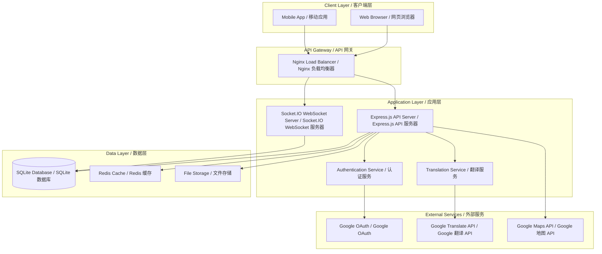
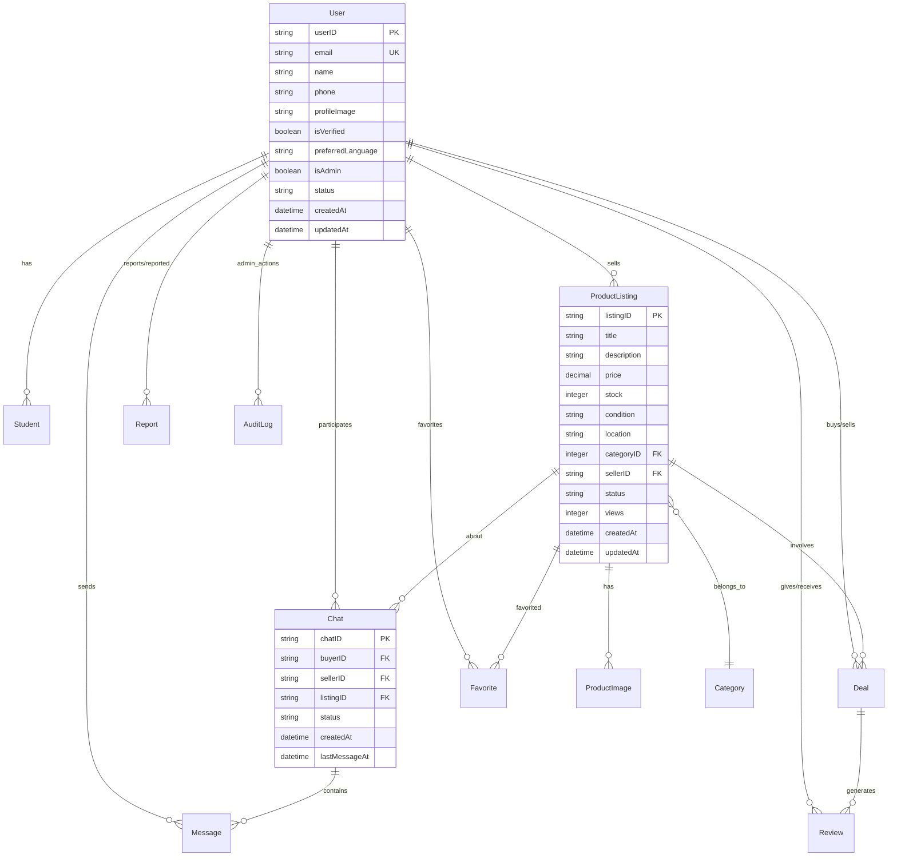

# Design Document / 设计文档

## Overview / 概述

Uniy Market is a comprehensive university second-hand trading platform built with TypeScript, Express.js, and SQLite. The system follows a layered architecture with clear separation between data access, business logic, and presentation layers. The platform supports multilingual interfaces (English, Thai, Chinese), real-time communication via WebSocket, and integrates with external services including Google OAuth for authentication, Google Translate for multilingual support, and Google Maps for location services.

Uniy Market 是一个使用 TypeScript、Express.js 和 SQLite 构建的综合性大学二手交易平台。系统采用分层架构，在数据访问、业务逻辑和表示层之间有清晰的分离。平台支持多语言界面（英语、泰语、中文），通过 WebSocket 进行实时通信，并与外部服务集成，包括用于身份验证的 Google OAuth、用于多语言支持的 Google 翻译和用于位置服务的 Google 地图。

The current implementation has completed the foundational infrastructure including database schema with 14 tables, TypeScript data models with full CRUD operations, and comprehensive testing framework using Jest and fast-check for property-based testing.

当前实现已完成基础设施，包括具有 14 个表的数据库架构、具有完整 CRUD 操作的 TypeScript 数据模型，以及使用 Jest 和 fast-check 进行基于属性测试的综合测试框架。

## Architecture / 架构

### System Architecture / 系统架构



### Technology Stack / 技术栈

**Backend / 后端:**
- **Runtime**: Node.js with TypeScript for type safety / Node.js 配合 TypeScript 确保类型安全
- **Web Framework**: Express.js for RESTful API development / Express.js 用于 RESTful API 开发
- **Database**: SQLite for development, PostgreSQL for production / SQLite 用于开发，PostgreSQL 用于生产
- **Real-time Communication**: Socket.IO for WebSocket connections / Socket.IO 用于 WebSocket 连接
- **Authentication**: Google OAuth 2.0 integration / Google OAuth 2.0 集成
- **File Upload**: Multer for handling multipart/form-data / Multer 处理 multipart/form-data
- **Testing**: Jest for unit testing, fast-check for property-based testing / Jest 用于单元测试，fast-check 用于基于属性的测试

**External Integrations / 外部集成:**
- **Google OAuth 2.0**: User authentication and authorization / 用户认证和授权
- **Google Translate API**: Automatic message and content translation / 自动消息和内容翻译
- **Google Maps JavaScript API**: Location display and mapping / 位置显示和地图功能

## Components and Interfaces / 组件和接口

### Core Components / 核心组件

#### 1. Authentication Module / 认证模块

```typescript
interface AuthenticationService {
  // Google OAuth integration / Google OAuth 集成
  authenticateWithGoogle(authCode: string): Promise<AuthResult>;
  
  // Session management / 会话管理
  createSession(user: User): Promise<SessionToken>;
  validateSession(token: string): Promise<User | null>;
  invalidateSession(token: string): Promise<void>;
  
  // University email verification / 大学邮箱验证
  verifyUniversityEmail(email: string): Promise<boolean>;
  isEmailDomainWhitelisted(domain: string): Promise<boolean>;
}

interface AuthResult {
  user: User;
  token: SessionToken;
  isNewUser: boolean;
}

interface SessionToken {
  token: string;
  expiresAt: Date;
  userId: string;
}
```

#### 2. Product Management Module / 商品管理模块

```typescript
interface ProductService {
  // CRUD operations / CRUD 操作
  createProduct(productData: CreateProductRequest, sellerId: string): Promise<ProductListing>;
  updateProduct(listingId: string, updates: UpdateProductRequest, userId: string): Promise<ProductListing>;
  deleteProduct(listingId: string, userId: string): Promise<boolean>;
  getProduct(listingId: string): Promise<ProductWithDetails | null>;
  
  // Search and filtering / 搜索和筛选
  searchProducts(query: SearchQuery): Promise<PaginatedResponse<ProductListing>>;
  getProductsByCategory(categoryId: number, options: PaginationOptions): Promise<PaginatedResponse<ProductListing>>;
  
  // Image management / 图片管理
  uploadProductImages(listingId: string, files: Express.Multer.File[]): Promise<ProductImage[]>;
  deleteProductImage(imageId: string, userId: string): Promise<boolean>;
}

interface CreateProductRequest {
  title: string;
  description?: string;
  price: number;
  stock: number;
  condition: 'new' | 'used' | 'like_new';
  location?: string;
  categoryID: number;
}

interface SearchQuery {
  keyword?: string;
  filters: SearchFilters;
  pagination: PaginationOptions;
}
```

#### 3. Chat and Messaging Module / 聊天和消息模块

```typescript
interface ChatService {
  // Chat management / 聊天管理
  createChat(buyerId: string, sellerId: string, listingId: string): Promise<Chat>;
  getChatsByUser(userId: string): Promise<Chat[]>;
  deleteChat(chatId: string, userId: string): Promise<boolean>;
  
  // Message handling / 消息处理
  sendMessage(chatId: string, senderId: string, messageData: SendMessageRequest): Promise<Message>;
  getMessages(chatId: string, pagination: PaginationOptions): Promise<PaginatedResponse<Message>>;
  markMessagesAsRead(chatId: string, userId: string): Promise<void>;
}

interface WebSocketService {
  // Real-time communication / 实时通信
  joinChatRoom(userId: string, chatId: string): void;
  leaveChatRoom(userId: string, chatId: string): void;
  broadcastMessage(chatId: string, message: Message): void;
  sendNotification(userId: string, notification: Notification): void;
}

interface SendMessageRequest {
  messageText: string;
  messageType: 'text' | 'image';
  imagePath?: string;
}
```

#### 4. Translation Module / 翻译模块

```typescript
interface TranslationService {
  // Google Translate integration / Google 翻译集成
  translateText(text: string, targetLanguage: string, sourceLanguage?: string): Promise<TranslationResult>;
  detectLanguage(text: string): Promise<string>;
  
  // Automatic message translation / 自动消息翻译
  translateMessage(message: Message, targetLanguage: string): Promise<Message>;
  
  // Batch translation for UI / 批量翻译用于界面
  translateBatch(texts: string[], targetLanguage: string): Promise<string[]>;
}

interface TranslationResult {
  translatedText: string;
  sourceLanguage: string;
  confidence: number;
}
```

#### 5. User Reputation Module / 用户声誉模块

```typescript
interface ReputationService {
  // Rating management / 评价管理
  submitRating(reviewData: CreateReviewRequest): Promise<Review>;
  getUserReputation(userId: string): Promise<UserReputation>;
  getReviewsByUser(userId: string, type?: 'received' | 'given'): Promise<Review[]>;
  
  // Reputation calculation / 声誉计算
  calculateReputation(userId: string): Promise<UserReputation>;
  updateReputationScore(userId: string): Promise<void>;
}

interface CreateReviewRequest {
  rating: number; // 1-5
  comment?: string;
  targetUserId: string;
  dealId?: string;
  reviewType: 'buyer_to_seller' | 'seller_to_buyer';
}
```

### API Endpoints / API 端点

#### Authentication Endpoints / 认证端点

```typescript
// Authentication routes / 认证路由
POST   /api/auth/google          // Google OAuth callback / Google OAuth 回调
POST   /api/auth/logout          // User logout / 用户注销
GET    /api/auth/profile         // Get current user profile / 获取当前用户资料
PUT    /api/auth/profile         // Update user profile / 更新用户资料
POST   /api/auth/verify-email    // Verify university email / 验证大学邮箱
```

#### Product Endpoints / 商品端点

```typescript
// Product management routes / 商品管理路由
GET    /api/products             // Search products / 搜索商品
POST   /api/products             // Create new product / 创建新商品
GET    /api/products/:id         // Get product details / 获取商品详情
PUT    /api/products/:id         // Update product / 更新商品
DELETE /api/products/:id         // Delete product / 删除商品
POST   /api/products/:id/images  // Upload product images / 上传商品图片
DELETE /api/products/images/:id  // Delete product image / 删除商品图片
GET    /api/categories           // Get all categories / 获取所有类别
```

#### Chat Endpoints / 聊天端点

```typescript
// Chat and messaging routes / 聊天和消息路由
GET    /api/chats               // Get user's chats / 获取用户聊天
POST   /api/chats               // Create new chat / 创建新聊天
GET    /api/chats/:id/messages  // Get chat messages / 获取聊天消息
POST   /api/chats/:id/messages  // Send message / 发送消息
DELETE /api/chats/:id           // Delete chat / 删除聊天
PUT    /api/chats/:id/read      // Mark messages as read / 标记消息为已读
```

## Data Models / 数据模型

### Database Schema / 数据库架构

The system uses a relational database with 14 core tables, implementing proper foreign key constraints and indexing for optimal performance. The schema supports multilingual content, user reputation tracking, and comprehensive audit logging.

系统使用关系数据库，包含 14 个核心表，实现了适当的外键约束和索引以获得最佳性能。架构支持多语言内容、用户声誉跟踪和全面的审计日志。

#### Core Entities / 核心实体



### Data Access Layer / 数据访问层

The system implements a robust data access layer using the Repository pattern with TypeScript models extending a BaseModel class. This provides consistent CRUD operations, transaction management, and type safety across all data operations.

系统使用存储库模式实现了强大的数据访问层，TypeScript 模型扩展了 BaseModel 类。这为所有数据操作提供了一致的 CRUD 操作、事务管理和类型安全。

```typescript
// Base model with common functionality / 具有通用功能的基础模型
abstract class BaseModel {
  protected db: Database;
  
  // Transaction management / 事务管理
  protected async withTransaction<T>(operation: () => Promise<T>): Promise<T>;
  
  // Common query methods / 通用查询方法
  protected async query(sql: string, params: any[]): Promise<any[]>;
  protected async queryOne(sql: string, params: any[]): Promise<any>;
  protected async execute(sql: string, params: any[]): Promise<any>;
  
  // ID generation / ID 生成
  protected generateId(prefix: string): string;
}

// Specialized models for each entity / 每个实体的专门模型
class UserModel extends BaseModel {
  async createUser(userData: Omit<User, 'userID' | 'createdAt' | 'updatedAt'>): Promise<User>;
  async getUserById(userID: string): Promise<User | null>;
  async getUserByEmail(email: string): Promise<User | null>;
  async updateUser(userID: string, updates: Partial<User>): Promise<User>;
  async getUserReputation(userID: string): Promise<UserReputation>;
  async isUniversityEmail(email: string): Promise<boolean>;
}

class ProductModel extends BaseModel {
  async createProduct(productData: CreateProductRequest): Promise<ProductListing>;
  async searchProducts(query: SearchQuery): Promise<PaginatedResponse<ProductListing>>;
  async getProductById(listingID: string): Promise<ProductListing | null>;
  async updateProduct(listingID: string, updates: Partial<ProductListing>): Promise<ProductListing>;
  async addProductImage(imageData: Omit<ProductImage, 'imageID' | 'uploadedAt'>): Promise<ProductImage>;
}
```

## Correctness Properties / 正确性属性

*A property is a characteristic or behavior that should hold true across all valid executions of a system—essentially, a formal statement about what the system should do. Properties serve as the bridge between human-readable specifications and machine-verifiable correctness guarantees.*

*属性是在系统的所有有效执行中都应该成立的特征或行为——本质上是关于系统应该做什么的正式声明。属性是人类可读规范和机器可验证正确性保证之间的桥梁。*

Based on the prework analysis, the following properties have been identified to validate the system's correctness across all acceptance criteria:

基于预工作分析，已识别出以下属性来验证系统在所有验收标准中的正确性：

### Property 1: Google OAuth Authentication Flow
*For any* user attempting to authenticate, the Google OAuth 2.0 flow should successfully create a session with proper token management and university email verification
**Validates: Requirements 1.1, 1.2, 1.3, 1.4, 1.5**

### Property 2: Product Listing Management
*For any* verified student creating a product listing, the system should generate unique identifiers, validate all required fields, and store the listing with proper categorization
**Validates: Requirements 2.1, 2.4**

### Property 3: File Upload Security and Validation
*For any* file upload operation, the system should validate file types, optimize images, and store them securely with proper access controls
**Validates: Requirements 2.2, 8.2**

### Property 4: Comprehensive Search and Filtering
*For any* search query with filters, the system should return relevant results based on keywords, categories, price ranges, location, and support proper sorting and pagination
**Validates: Requirements 2.3, 7.1, 7.2, 7.3, 7.5**

### Property 5: Product Status Management
*For any* product status change (sold, inactive), the system should update the listing status and remove it from active search results while maintaining data integrity
**Validates: Requirements 2.5**

### Property 6: Multi-Language Interface Support
*For any* language preference selection, the system should display the interface in the chosen language (English, Thai, Chinese) and update immediately without page refresh
**Validates: Requirements 3.1, 3.4**

### Property 7: Automatic Translation Service Integration
*For any* message or content requiring translation, the system should preserve the original text, provide accurate translation, and display both versions appropriately
**Validates: Requirements 3.2, 3.3, 3.5, 4.4**

### Property 8: Real-Time Chat System
*For any* buyer-seller interaction, the system should create chat channels, deliver messages in real-time via WebSocket, support multiple message types, and send proper notifications
**Validates: Requirements 4.1, 4.2, 4.3, 4.6**

### Property 9: Chat Management and Deletion
*For any* chat deletion operation, the system should remove all associated messages, notify both participants, and maintain data consistency
**Validates: Requirements 4.5, 4.7**

### Property 10: Bidirectional Rating System
*For any* completed transaction, the system should allow both parties to rate each other with proper validation (1-5 scale) and optional comments
**Validates: Requirements 5.1, 5.2**

### Property 11: Comprehensive Reputation Calculation
*For any* user with ratings, the system should calculate separate averages for buying and selling activities and display complete reputation information including transaction counts
**Validates: Requirements 5.3, 5.4, 5.5**

### Property 12: Location Privacy Management
*For any* location data entry or display, the system should protect user privacy by storing only general area descriptions and displaying approximate locations on maps
**Validates: Requirements 6.1, 6.2, 6.3, 6.4, 6.5**

### Property 13: Content Filtering and Moderation
*For any* content posted to the system, it should be filtered against multilingual sensitive word databases with appropriate flagging and blocking mechanisms
**Validates: Requirements 10.1, 10.2**

### Property 14: Reporting Mechanism
*For any* report submission, the system should create properly categorized report records with all required information and provide admin tools for resolution
**Validates: Requirements 10.3, 10.4, 10.5**

### Property 15: Transaction Management
*For any* buyer-seller agreement, the system should create deal records, track status changes, update product availability, and maintain transaction history
**Validates: Requirements 9.1, 9.2, 9.3, 9.4, 9.5**

### Property 16: Favorites Management
*For any* user interaction with favorites, the system should provide add/remove functionality, maintain synchronization with product status, and display current availability
**Validates: Requirements 11.1, 11.2, 11.3, 11.4, 11.5**

### Property 17: Administrative Management Tools
*For any* administrative operation, the system should require proper authentication, provide comprehensive management interfaces, and maintain complete audit logs
**Validates: Requirements 12.1, 12.2, 12.3, 12.4, 12.5**

### Property 18: Data Integrity and Security
*For any* data operation, the system should enforce foreign key constraints, handle cascading deletions properly, implement authorization checks, and maintain audit trails
**Validates: Requirements 13.1, 13.2, 13.3, 13.5**

### Property 19: Error Handling and Logging
*For any* error condition, the system should log errors appropriately and provide meaningful error messages to users while maintaining system stability
**Validates: Requirements 8.5**

## Error Handling / 错误处理

### Error Categories / 错误类别

The system implements comprehensive error handling across multiple categories:

系统在多个类别中实现全面的错误处理：

#### 1. Authentication Errors / 认证错误
- **Invalid OAuth Token**: Return 401 Unauthorized with clear message / 返回 401 未授权并提供清晰消息
- **Expired Session**: Redirect to login with session timeout message / 重定向到登录页面并显示会话超时消息
- **University Email Verification Failed**: Return 403 Forbidden with domain validation error / 返回 403 禁止访问并显示域名验证错误
- **Insufficient Permissions**: Return 403 Forbidden with permission details / 返回 403 禁止访问并显示权限详情

#### 2. Validation Errors / 验证错误
- **Invalid Input Data**: Return 400 Bad Request with field-specific validation messages / 返回 400 错误请求并显示字段特定验证消息
- **File Upload Errors**: Return 400 Bad Request with file type/size validation details / 返回 400 错误请求并显示文件类型/大小验证详情
- **Business Rule Violations**: Return 422 Unprocessable Entity with business logic explanation / 返回 422 无法处理实体并显示业务逻辑说明

#### 3. Resource Errors / 资源错误
- **Not Found**: Return 404 Not Found with resource identification / 返回 404 未找到并标识资源
- **Conflict**: Return 409 Conflict for duplicate resources or concurrent modifications / 对于重复资源或并发修改返回 409 冲突
- **Rate Limiting**: Return 429 Too Many Requests with retry information / 返回 429 请求过多并提供重试信息

#### 4. External Service Errors / 外部服务错误
- **Google API Failures**: Graceful degradation with fallback mechanisms / 优雅降级并提供回退机制
- **Translation Service Unavailable**: Display original content with translation unavailable notice / 显示原始内容并提供翻译不可用通知
- **Map Service Errors**: Show text-based location information as fallback / 显示基于文本的位置信息作为回退

### Error Response Format / 错误响应格式

```typescript
interface ErrorResponse {
  success: false;
  error: {
    code: string;           // Machine-readable error code / 机器可读错误代码
    message: string;        // Human-readable error message / 人类可读错误消息
    details?: any;          // Additional error context / 额外错误上下文
    field?: string;         // Field name for validation errors / 验证错误的字段名
    timestamp: string;      // Error occurrence time / 错误发生时间
    requestId: string;      // Unique request identifier for tracking / 用于跟踪的唯一请求标识符
  };
}
```

### Logging Strategy / 日志策略

```typescript
// Error logging levels / 错误日志级别
enum LogLevel {
  ERROR = 'error',      // System errors requiring immediate attention / 需要立即关注的系统错误
  WARN = 'warn',        // Warning conditions / 警告条件
  INFO = 'info',        // General information / 一般信息
  DEBUG = 'debug'       // Debug information / 调试信息
}

// Structured logging format / 结构化日志格式
interface LogEntry {
  level: LogLevel;
  message: string;
  timestamp: string;
  requestId: string;
  userId?: string;
  error?: Error;
  context?: Record<string, any>;
}
```

## Testing Strategy / 测试策略

### Dual Testing Approach / 双重测试方法

The system employs a comprehensive testing strategy combining unit tests and property-based tests to ensure both specific functionality and universal correctness properties.

系统采用综合测试策略，结合单元测试和基于属性的测试，以确保特定功能和通用正确性属性。

#### Unit Testing / 单元测试
- **Specific Examples**: Test concrete scenarios with known inputs and expected outputs / 使用已知输入和预期输出测试具体场景
- **Edge Cases**: Validate boundary conditions and error handling / 验证边界条件和错误处理
- **Integration Points**: Test component interactions and external service integrations / 测试组件交互和外部服务集成
- **Mock External Services**: Use mocks for Google APIs to ensure consistent testing / 使用模拟 Google API 确保一致的测试

#### Property-Based Testing / 基于属性的测试
- **Universal Properties**: Validate properties that hold for all valid inputs using fast-check / 使用 fast-check 验证对所有有效输入都成立的属性
- **Randomized Input Generation**: Generate diverse test cases automatically / 自动生成多样化测试用例
- **Comprehensive Coverage**: Test edge cases that might be missed in manual test writing / 测试手动编写测试可能遗漏的边界情况
- **Minimum 100 Iterations**: Each property test runs at least 100 iterations for thorough validation / 每个属性测试至少运行 100 次迭代以进行彻底验证

### Testing Configuration / 测试配置

```typescript
// Jest configuration for property-based testing / Jest 配置用于基于属性的测试
module.exports = {
  preset: 'ts-jest',
  testEnvironment: 'node',
  setupFilesAfterEnv: ['<rootDir>/tests/setup.ts'],
  testMatch: [
    '<rootDir>/tests/unit/**/*.test.ts',
    '<rootDir>/tests/property/**/*.test.ts',
    '<rootDir>/tests/integration/**/*.test.ts'
  ],
  collectCoverageFrom: [
    'src/**/*.ts',
    '!src/**/*.d.ts',
    '!src/types/**/*'
  ],
  coverageThreshold: {
    global: {
      branches: 80,
      functions: 80,
      lines: 80,
      statements: 80
    }
  }
};

// Property test configuration / 属性测试配置
const propertyTestConfig = {
  numRuns: 100,           // Minimum iterations per property / 每个属性的最小迭代次数
  timeout: 5000,          // Test timeout in milliseconds / 测试超时（毫秒）
  seed: 42,               // Reproducible random seed / 可重现的随机种子
  verbose: true           // Detailed output for debugging / 详细输出用于调试
};
```

### Test Organization / 测试组织

```typescript
// Property test example with proper tagging / 带有适当标记的属性测试示例
describe('Uniy Market Property Tests', () => {
  test('Property 1: Google OAuth Authentication Flow', () => {
    // Feature: ict-project-system, Property 1: Google OAuth Authentication Flow
    fc.assert(fc.property(
      fc.record({
        email: fc.emailAddress(),
        name: fc.string({ minLength: 1, maxLength: 100 }),
        googleId: fc.string({ minLength: 10, maxLength: 50 })
      }),
      async (userData) => {
        // Test OAuth authentication flow
        const result = await authService.authenticateWithGoogle(userData);
        expect(result.user).toBeDefined();
        expect(result.token).toBeDefined();
        expect(result.user.email).toBe(userData.email);
      }
    ), propertyTestConfig);
  });
});
```

### Test Coverage Requirements / 测试覆盖要求

- **Unit Tests**: Focus on specific examples, error conditions, and integration scenarios / 专注于特定示例、错误条件和集成场景
- **Property Tests**: Validate all 19 correctness properties with comprehensive input generation / 通过全面的输入生成验证所有 19 个正确性属性
- **Integration Tests**: Test complete user workflows and external API interactions / 测试完整的用户工作流程和外部 API 交互
- **Coverage Target**: Maintain minimum 80% code coverage across all test types / 在所有测试类型中保持最低 80% 的代码覆盖率

The testing strategy ensures that both specific functionality works correctly and that universal properties hold across all possible inputs, providing comprehensive validation of the Uniy Market platform.

测试策略确保特定功能正确工作，并且通用属性在所有可能的输入中都成立，为 Uniy Market 平台提供全面的验证。